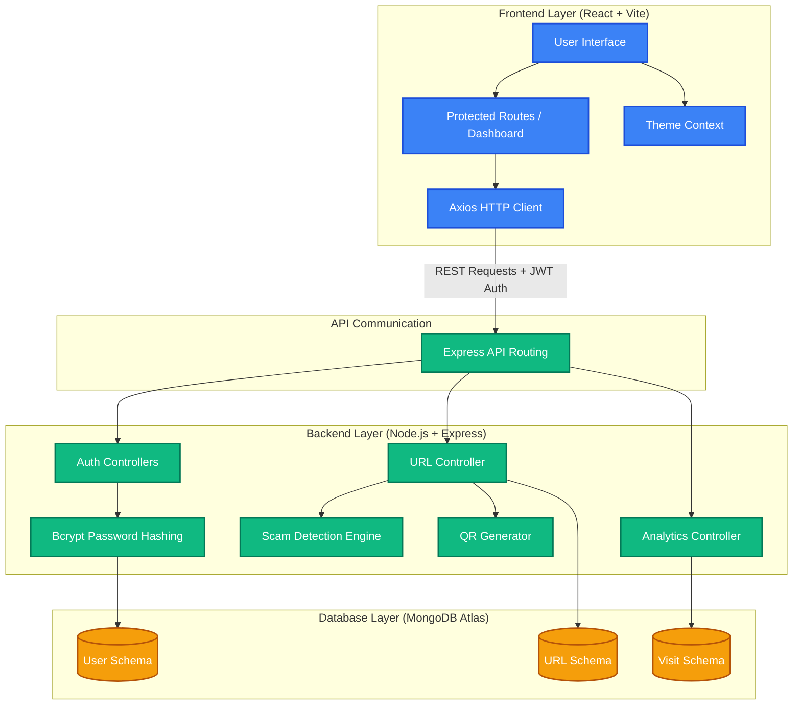
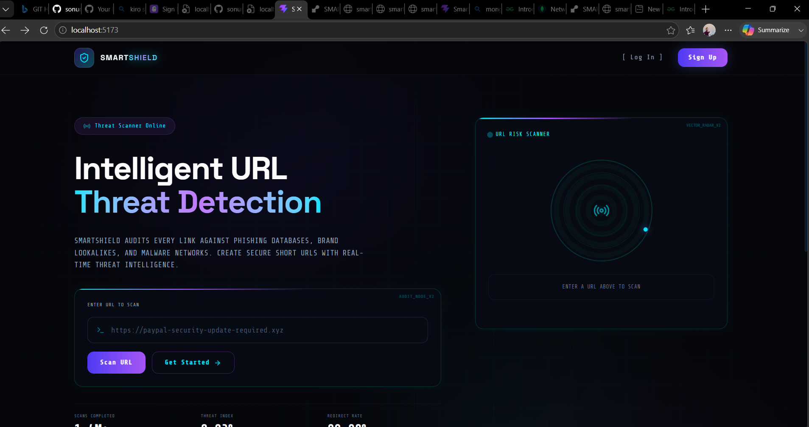
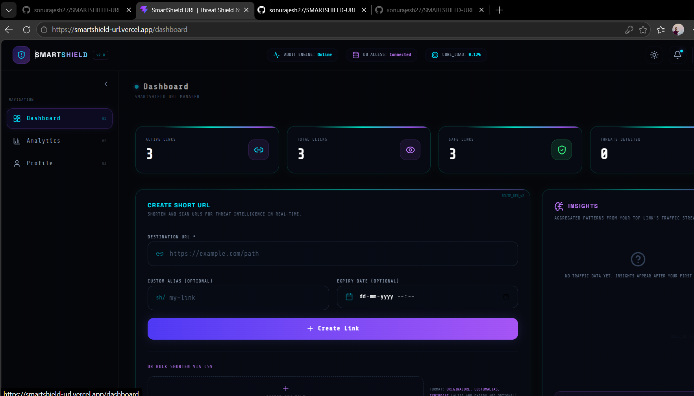
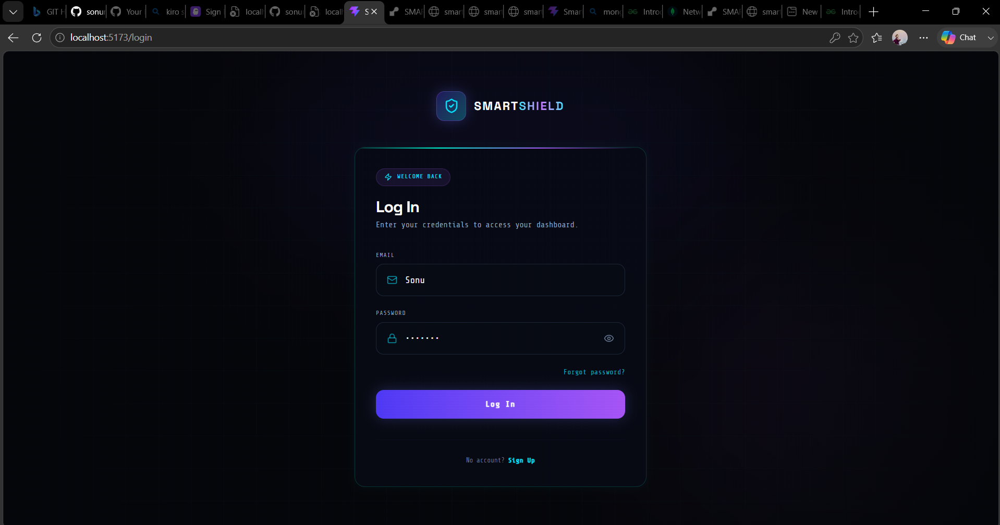
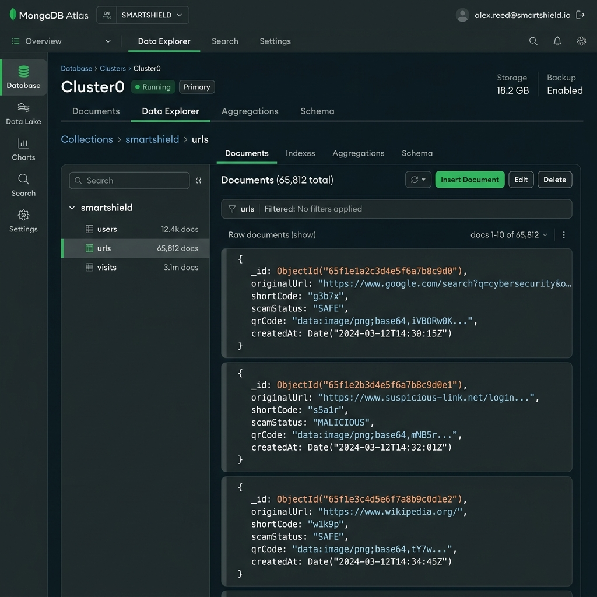
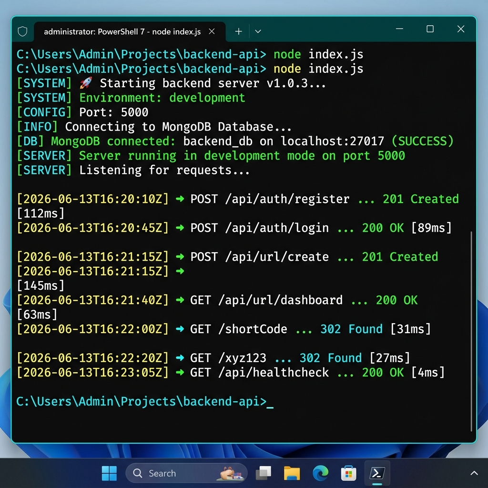

# 🛡️ SmartShield URL

**SmartShield URL** is a secure, intelligent URL shortener and real-time cyber-threat scanner. It helps users shorten long URLs while protecting them from phishing attempts, lookalike brand spoofing, malicious top-level domains, and unsafe tracking structures. 

Instead of just converting long URLs into smaller links, SmartShield URL analyzes every URL dynamically, computes a threat risk index, generates responsive neon QR codes, tracks visitor analytics, and provides natural-language AI insights inside a modern, dark, cybersecurity-inspired dashboard.

---

## 🚀 Project Overview

Traditional URL shorteners convert long links blindly. Users have no way of knowing whether the shortened link redirects to a safe page or a phishing portal.

**SmartShield URL solves this by combining:**
* **Secure URL Shortening:** Fast redirection with custom aliases and optional expiry limits.
* **Intelligent Threat Scanning:** Heuristic-based scans checking for typosquatting, suspicious TLDs, and phishing patterns.
* **Granular Analytics:** Real-time visitor tracking (Device, OS, Browser, Peak Hours).
* **Automated AI Insights:** Simple natural-language analytics reports describing user traffic behavior.
* **Instant QR Generation:** Live, customizable QR codes generated client-side for sharing.
* **State-of-the-Art Dark UI:** High-fidelity Glassmorphic dashboard with neon terminal layouts.

This platform is a production-ready full-stack application designed to make link sharing secure and transparent.

---

## ✨ Features

### 🔐 Secure Authentication
* **JWT Token Sessions:** Secure stateless authentication with token-expiration protection.
* **Bcrypt Password Salting:** State-of-the-art password hashing on user credentials.
* **Route Protection:** Seamless React middleware protecting dashboard routes from unauthorized access.
* **User-Specific Control:** Dashboard feeds and link details are siloed per user.

### 🔗 URL Shortening & Customization
* **Custom Aliases:** Allow users to choose their own short slugs (e.g., `http://localhost:5000/my-custom-slug`).
* **Expiration Control:** Automatically expire links (yielding `410 Gone`) after a selected timeframe.
* **Instant Copy-to-Clipboard:** Modern clipboard actions for shortened URLs and generated QR codes.

### 🛡️ Scam Detection Engine
* **Multivariate Risk Scoring:** Runs 6 distinct security rules to calculate a risk index from `0` to `100`:
  1. **IP Hostname Check:** Identifies raw IPs replacing standard hostnames (+40 Risk).
  2. **Suspicious TLD Checker:** Flags risky extensions like `.xyz`, `.top`, `.buzz`, `.ml`, `.ru` (+25 Risk).
  3. **Excessive Subdomain Audit:** Flags deep subdomain nests used in phish-kits (+20 Risk).
  4. **Lookalike Spoofing Heuristics:** Detects character replacements matching brands like Google, PayPal, Netflix (+35 Risk).
  5. **Hyphen/Double-Hyphen Check:** Identifies brand mimic patterns (+15 Risk).
  6. **Phishing Keyword Scanners:** Scans hosts/paths/queries for words like `verify`, `billing`, `secure`, `win-prize` (+25 Risk).
* **Classification Levels:** Renders interactive safety cards (**Safe**, **Suspicious**, or **Dangerous**) with specific reasons.

### 📊 Analytics Dashboard & AI Insights
* **Recharts Interactive Graphics:** Smooth neon curves representing clicks over time and donut graphs for devices/browsers.
* **Dynamic Geolocation & Client Parsing:** Captures device type, browser model, operating system, and IP address for redirect clicks.
* **Rule-Based AI Insights:** Automatically computes growth trends, dominant user client types, and peak usage hours (e.g., *"Peak traffic between 4 PM–6 PM"*).

### 📱 Client-Side QR Codes
* **Automatic Generation:** High-resolution QR codes generated immediately upon link shortening.
* **Seamless Download:** One-click downloads of QR codes for use on flyers, posters, or websites.

### 🎨 Premium UI/UX Design
* **Glassmorphic Layouts:** Modern CSS backdrops, neon borders, and cyber-grid meshes.
* **Radar Sweep Scanner:** Interactive simulated scanner on the homepage, rendering progress trackers and audit steps.
* **Smooth Animations:** Integrated with `framer-motion` for page-wrapper transitions.

---

## 🏗️ Tech Stack

### Frontend
* **React 19 / Vite 8:** Next-generation build toolchain and modular component tree.
* **Tailwind CSS v4:** Modern styling system for utility-first responsive layouts.
* **Recharts & Lucide React:** SVG charting graphics and modern vector icon library.
* **Framer Motion & React Hot Toast:** Aesthetic notification cues and smooth micro-animations.

### Backend
* **Node.js & Express.js:** Fast and scalable backend API router.
* **Express Rate Limiters:** Customized brute-force mitigations for Login, URL Generation, and Redirection routes.
* **Security Headers Middleware:** Implemented manual headers (`X-Frame-Options`, `X-Content-Type-Options`, `X-XSS-Protection`) to secure network responses.

### Database & Authentication
* **MongoDB Atlas:** Cloud-hosted NoSQL cluster.
* **Mongoose ODM:** Structured modeling for users, links, and analytics visits.
* **JWT (JSON Web Token) & bcryptjs:** Industry-standard secure sessions.

---

## 📂 Project Structure

```text
SMARTSHIELD-URL/
│
├── backend/                    # Express REST Server
│   ├── config/                 # DB connections and environment scripts
│   ├── controllers/            # Controller layers (Auth, URL, Analytics)
│   ├── middleware/             # Rate limiters, JWT audits, and input validation
│   ├── models/                 # Mongoose schemas (User, Url, Visit)
│   ├── routes/                 # Express endpoints
│   ├── utils/                  # Threat scanners, QR engines, and AI analytics
│   ├── tests/                  # Automated integration & unit tests
│   ├── server.js               # Express application entrypoint
│   └── package.json            # Backend dependencies
│
├── frontend/                   # React Single Page App
│   ├── src/
│   │   ├── components/         # Layout frame and navigation links
│   │   ├── context/            # React contexts (Theme, Authentication)
│   │   ├── hooks/              # Custom utilities
│   │   ├── pages/              # Main routes (Home, Dashboard, Stats, Profile)
│   │   ├── services/           # Axios HTTP request orchestrators
│   │   ├── utils/              # Helper formatters
│   │   └── App.jsx             # React Router routing tree
│   ├── vite.config.js          # Vite configs
│   ├── package.json            # Frontend packages
│   └── index.css               # Cyber-theme style definitions
│
├── docs/                       # System documentation and manuals
│   ├── ARCHITECTURE.md         # Database layouts, flowcharts & API details
│   ├── AI-PLANNING.md          # Project genesis, AI assistance, and goals
│   ├── FEATURES.md             # Complete features summary
│   └── WORKFLOW.md             # Guide on development workflow
│
├── screenshots/                # Visual previews of the interfaces
├── README.md                   # Main documentation file
└── LICENSE                     # Open-source MIT License
```

---

## ⚙️ Setup Instructions

### Prerequisites
* **Node.js** (v18 or above recommended)
* **npm** (v9 or above)
* **MongoDB Atlas** account (or local MongoDB database)

### Step 1: Clone the Repository
```bash
git clone https://github.com/your-username/SMARTSHIELD-URL.git
cd SMARTSHIELD-URL
```

### Step 2: Configure Environment Variables
Create a file named `.env` inside the `backend/` directory:
```env
PORT=5000
MONGO_URI=your_mongodb_connection_uri_here
JWT_SECRET=your_jwt_signing_key_here
NODE_ENV=development
ALLOWED_ORIGINS=http://localhost:5173
```

### Step 3: Launch the Backend
Open a terminal in the project directory, and execute:
```bash
cd backend
npm install
npm run dev
```
The API server will launch at `http://localhost:5000`.

### Step 4: Launch the Frontend
Open another terminal tab, and execute:
```bash
cd frontend
npm install
npm run dev
```
The Vite development server will open at `http://localhost:5173`.

---

## 🧪 Testing Suites

SmartShield URL includes robust unit and integration tests to ensure security, redirect speed, and scanning accuracy.

### 1. Offline Unit Tests
Tests the scam scanner rules, AI insights, and inputs validation without hitting database instances.
```bash
cd backend
node tests/unit_test.js
```

### 2. Integration Tests
Runs active database verification checks, testing authentication, redirects, link expiry, and database analytics insertion.
```bash
cd backend
npm test
```

---

## 🧩 Architectural Design

### System Overview Diagram



---

## 📝 Assumptions Made

* **Authentication Boundaries:** Users must be logged in to access historical click analytics and customise URLs.
* **Scan Rules:** Suspicious checks use local heuristic evaluation. Enterprise intelligence databases (like Google Safe Browsing) are not queries to ensure maximum privacy and zero latency.
* **Redirection Latency:** The system prioritizes immediate redirection. Visits analysis records are captured asynchronously in the background.
* **Analytics Expiry:** Links configured with expiration times reject traffic with HTTP `410 Gone` to indicate retired URLs.
* **Cookie-free Tracking:** Device analytics are inferred from the `User-Agent` and client IP to avoid cookie banners.

---

## 🎥 Project Demonstration

* **Watch the Walkthrough:** [](https://www.loom.com/share/07fe3a42cdbe471eabff96d7d3427f3d)

---

## 📸 Screenshots

Below are the interface layout previews available in the `screenshots/` directory:

| Section | Preview Image |
| :--- | :--- |
| **Home Page (Threat Scanner)** |  |
| **Dashboard (Links Deck)** |  |
| **Analytics (Interactive Charts)** |  |
| **Login / Credentials** |  |
| **MongoDB Atlas Collections** |  |
| **Backend Terminal Logs** |  |

---

## 📌 Sample Outputs

Descriptions of the sample outputs (visualized in the **Screenshots** table above):
* **URL Shortening Output:** Displays the list of shortened links, custom aliases, creation records, and QR code options.
* **Scam Detection Result:** Shows warning banners, calculated risk indices, and flagged threat reasons.
* **Analytics Output:** Visualizes total clicks, visitor client devices, browsers, and hourly distributions.
* **MongoDB Database Entries:** Shows structured database records inside the `users`, `urls`, and `visits` collections in MongoDB Atlas.
* **Backend Logs:** Shows live console traces of the Express server routing HTTP requests and enforcing rate limits.

---

## 🌍 Live Deployment

* **Deployed Frontend Application:** [https://smartshield-url.vercel.app/](https://smartshield-url.vercel.app/)
* **Backend Live API Server:** [https://smartshield-url-1.onrender.com](https://smartshield-url-1.onrender.com)

---

## 📌 Problem Statement Coverage

This project satisfies all requirements for URL management:

* ✅ **Short Link Creation:** Converts complex paths to clean, short identifiers.
* ✅ **Redirection Logging:** Captures all clicks, creation logs, and expiration limits.
* ✅ **Detailed Statistics:** Integrates Recharts to review visitor types, browsers, and hourly distributions.
* ✅ **Scam Scan Flagging:** Real-time feedback warnings on malicious URL structures.
* ✅ **Printable QR Codes:** Automatically generates QR codes for physical sharing.

---

This project is a part of a hackathon run by https://katomaran.com

## 📄 License

Licensed under the [MIT License](file:///LICENSE).
