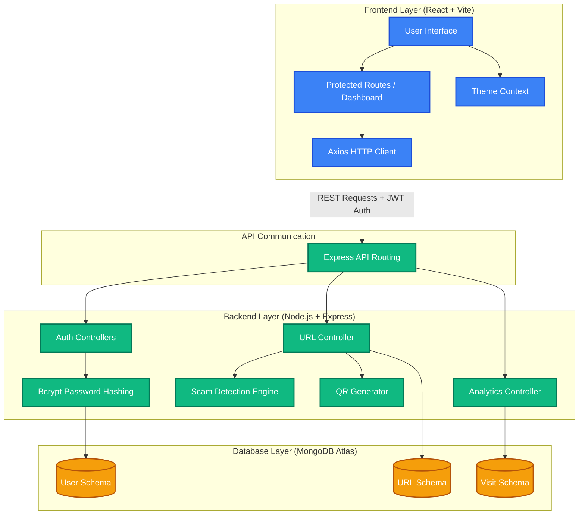

# SmartShield URL - System Architecture and Workflow

## Overview
This document explains the architecture of the SmartShield URL platform. The application follows a full-stack web architecture where the frontend manages user interaction, the backend handles business logic and API processing, and MongoDB stores application data securely.

The system is designed to support secure authentication, URL shortening, phishing detection, analytics tracking, QR code generation, and dashboard-based user management while remaining scalable and maintainable.

## High-Level Architecture
The SmartShield URL platform follows a structured three-layer architecture where each layer has a specific responsibility.

```text
Frontend (React + Vite)
        ↓
Axios API Calls
        ↓
Backend (Node.js + Express)
        ↓
MongoDB Database
```

### Visual Architecture Diagram
The diagram below shows the structural components, data flow, and interactions between the frontend, backend, and database:




## Frontend Layer
The frontend is built using React and Vite. It provides the user interface for authentication, URL management, analytics visualization, and dashboard operations.

### Responsibilities
- Rendering the user interface
- Handling forms and user input
- Managing protected route navigation
- Sending API requests using Axios
- Displaying analytics charts
- Managing user sessions

## Backend Layer
The backend is developed using Node.js and Express.js. It handles authentication, URL shortening, redirect processing, analytics tracking, scam detection, and other business logic.

### Responsibilities
- Handling REST APIs
- Managing JWT authentication
- Processing URL shortening logic
- Handling redirects
- Running scam detection checks
- Tracking analytics
- Communicating with MongoDB

## Database Layer
MongoDB is used as the primary database for storing platform data.

### Stored Data
- User information
- Authentication records
- URL details
- Analytics data
- Scam detection results
- Visit tracking information

## Authentication Architecture
The authentication system is based on JWT (JSON Web Token) to secure user sessions and protect private routes.

### Authentication Structure
```text
User Signup / Login
        ↓
Backend validates credentials
        ↓
JWT token generated
        ↓
Token stored in local storage
        ↓
Protected API access
```

### Protected Features
- Dashboard access
- Analytics page
- Profile page
- URL management

## URL Shortening Architecture
The URL shortening module is responsible for converting long URLs into short and manageable links.

### Structure
```text
User enters long URL
        ↓
Backend validates URL
        ↓
Scam detection executed
        ↓
Unique short code generated
        ↓
Data stored in MongoDB
        ↓
Short URL returned to frontend
```

### Main Functions
- URL validation
- Scam detection integration
- Unique code generation
- URL record storage
- Short URL creation

## Redirect Architecture
The redirect module ensures that each short URL points to the correct original destination.

### Structure
```text
User clicks short URL
        ↓
Backend receives short code
        ↓
Database lookup performed
        ↓
Visit recorded
        ↓
Redirect to original URL
```

### Main Functions
- Short code lookup
- Original URL retrieval
- Visit recording
- Redirect handling

## Scam Detection Architecture
The scam detection module helps identify suspicious or unsafe links before they are shared.

### Structure
```text
URL submitted
      ↓
Validation checks
      ↓
Risk analysis engine
      ↓
Safety classification
      ↓
Safe / Suspicious / Dangerous
      ↓
Response sent to frontend
```

### Detection Components
- Suspicious keyword checks
- Unsafe domain checks
- Typosquatting detection
- URL abnormality analysis
- Phishing risk indicators

### Risk Levels
- Safe
- Suspicious
- Dangerous

## Analytics Architecture
The analytics system records URL activity and displays performance information in the dashboard.

### Structure
```text
Short URL clicked
        ↓
Visit recorded in database
        ↓
Browser and device tracked
        ↓
Analytics aggregated
        ↓
Dashboard visualization
```

### Analytics Data
- Total clicks
- Browser information
- Device type
- Usage activity
- URL performance trends

## Dashboard Architecture
The dashboard acts as the main management area of the platform and is accessible only after authentication.

### Core Areas
- URL creation
- URL management
- Scam detection results
- Analytics overview
- Profile access
- User activity monitoring

## API Communication Architecture
The frontend and backend communicate through REST APIs using Axios.

### Communication Structure
```text
Frontend request
        ↓
Axios API call
        ↓
Express API endpoint
        ↓
Business logic processing
        ↓
MongoDB query
        ↓
Response returned to frontend
```

### Key Benefits
- Fast communication
- Secure token-based requests
- Organized data handling

## Folder Structure Overview

### Frontend Structure
```text
frontend/
│── src/
│   ├── pages/
│   ├── components/
│   ├── context/
│   ├── services/
│   ├── utils/
│   └── App.jsx
```

### Backend Structure
```text
backend/
│── controllers/
│── models/
│── routes/
│── middleware/
│── utils/
│── server.js
```

## Technology Stack

### Frontend
- React
- Vite
- Tailwind CSS
- Axios
- Recharts
- Lucide React

### Backend
- Node.js
- Express.js

### Database
- MongoDB / MongoDB Atlas

### Authentication
- JWT (JSON Web Token)
- bcryptjs

### Additional Features
- QR code generation
- Scam detection engine
- Analytics tracking

## Deployment Architecture
The system is deployed as a full-stack web application with separate frontend and backend deployment to improve scalability and maintainability.

```text
Frontend Hosting
       ↓
Connected through APIs
       ↓
Backend Server
       ↓
MongoDB Atlas Database
```

This deployment structure improves scalability, maintainability, and performance.

## Conclusion
The SmartShield URL platform follows a clean full-stack architecture built for secure URL shortening, phishing detection, analytics tracking, and authenticated user management. By separating frontend, backend, and database responsibilities, the platform stays organized and supports future scaling and maintenance.
